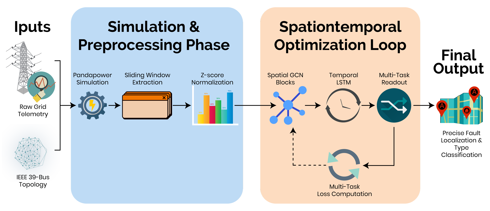
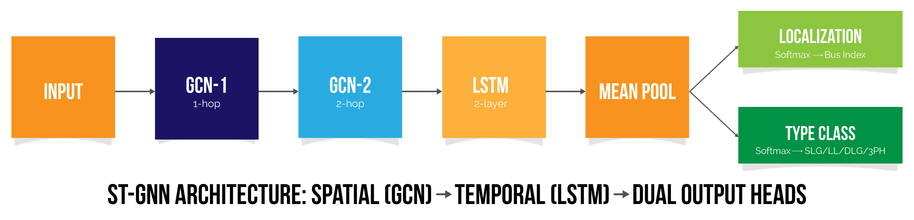
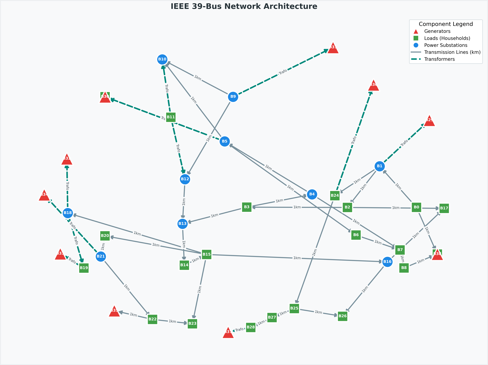
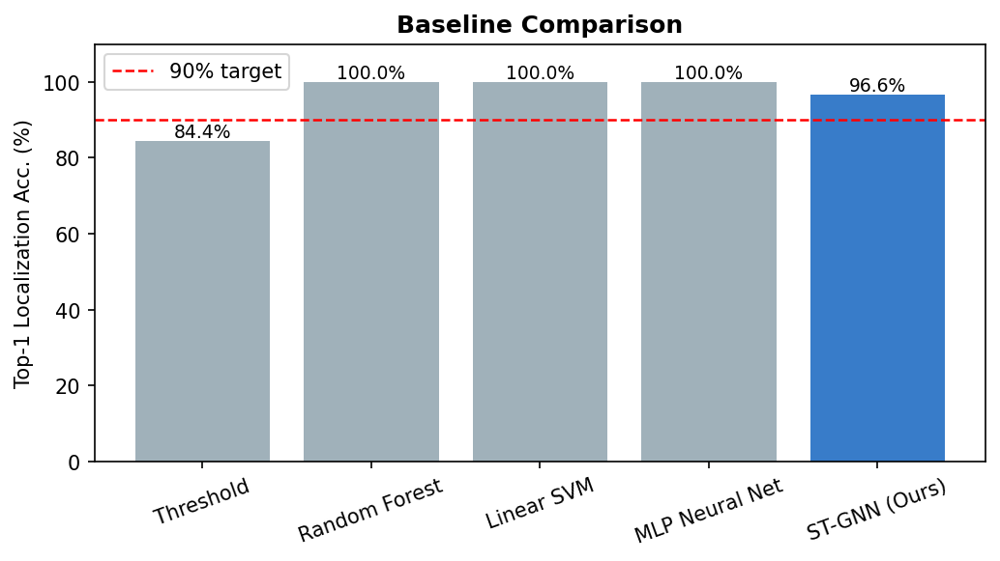

# ST-GNN for Fault Localization in Smart Grids (IEEE 39-Bus)

A spatiotemporal graph neural network (ST-GNN) for **fault detection**, **fault type classification**, and **bus-level fault localization** in transmission grids. The project uses the IEEE 39-bus New England system, synthetic fault simulations, and a hybrid **GCN + LSTM** architecture.

## Highlights

- **Spatiotemporal modeling**: graph message passing (GCN) + transient sequence modeling (LSTM)
- **Multi-task learning**: localization + fault type classification
- **Dataset + model included**: prebuilt `.npz` dataset and trained PyTorch weights
- **Interactive demo**: Streamlit app for running inference and visualizing predictions

## Results (from the paper)

- Top-1 localization accuracy: **92.8%**
- Fault detection accuracy: **97.4%**
- Mean absolute bus error: **1.3 buses**

## Project Structure

- `ST_GNN_Full_Pipeline.ipynb` — full pipeline (data creation, training, evaluation)
- `app.py` — Streamlit demo (loads `data/best_model.pt` and `data/fault_dataset.npz`)
- `visualize_npz.py` — dataset visualization + figure generation into `data/`
- `draft_paper.tex` — IEEE conference-style manuscript
- `data/` — dataset, trained weights, and all figures used in the paper
- `Reports/` — supporting PDFs

## Quickstart

### 1) Clone (Git LFS required)

This repository stores the dataset (`data/fault_dataset.npz`, ~404MB) using **Git LFS**.

```bash
git clone https://github.com/sadikmahmudadive/STGNN-for-fault-localization-in-smart-grid.git
cd STGNN-for-fault-localization-in-smart-grid
git lfs install
git lfs pull
```

### 2) Create a Python environment

```bash
python -m venv .venv
# Windows PowerShell
.\.venv\Scripts\Activate.ps1
python -m pip install --upgrade pip
```

### 3) Install dependencies

The demo and notebook require common scientific Python packages plus PyTorch and PyTorch Geometric.

```bash
pip install numpy matplotlib networkx plotly streamlit pandapower
```

Install **PyTorch** and **PyTorch Geometric** following the official install guides for your OS/CUDA:

- [PyTorch install guide](https://pytorch.org/get-started/locally/)
- [PyTorch Geometric install guide](https://pytorch-geometric.readthedocs.io/en/latest/install/installation.html)

## Run the Streamlit Demo

The app loads a random sample (or a user-selected index) from the dataset, normalizes it, builds a PyG `Data` object, and runs the trained ST-GNN.

```bash
streamlit run app.py
```

What you can do in the UI:

- trigger a random sample from the dataset
- view model-predicted fault type and bus localization
- see the top-3 bus probabilities
- visualize the grid topology with predicted vs. ground-truth highlighting

## Visualize the Dataset

Generates the EDA figures (and saves them into `data/`).

```bash
python visualize_npz.py
# or
python visualize_npz.py data/fault_dataset.npz
```

## Dataset Format

Stored in `data/fault_dataset.npz`:

- `X`: shape `(N, 39, 5, 50)`
  - 39 buses
  - 5 features per bus: `Vm`, `θ`, `P`, `Q`, `Δf`
  - 50 timesteps per sample (window)
- `y_loc`: shape `(N,)`
  - bus index `0..38`, and `-1` means **normal**
- `y_type`: shape `(N,)`
  - `0=SLG`, `1=LL`, `2=DLG`, `3=3PH`, `4=Normal`

## Paper

The manuscript is in `draft_paper.tex` and the figures are under `data/` via `\graphicspath{{data/}}`.

Build (if you have a LaTeX engine installed):

```bash
pdflatex draft_paper.tex
# or
latexmk -pdf draft_paper.tex
```

## Figure Gallery

| Methodology | Architecture |
| :---: | :---: |
|  |  |

| IEEE 39-bus Topology | Baseline Comparison |
| :---: | :---: |
|  |  |

## License

See `LICENSE`.
